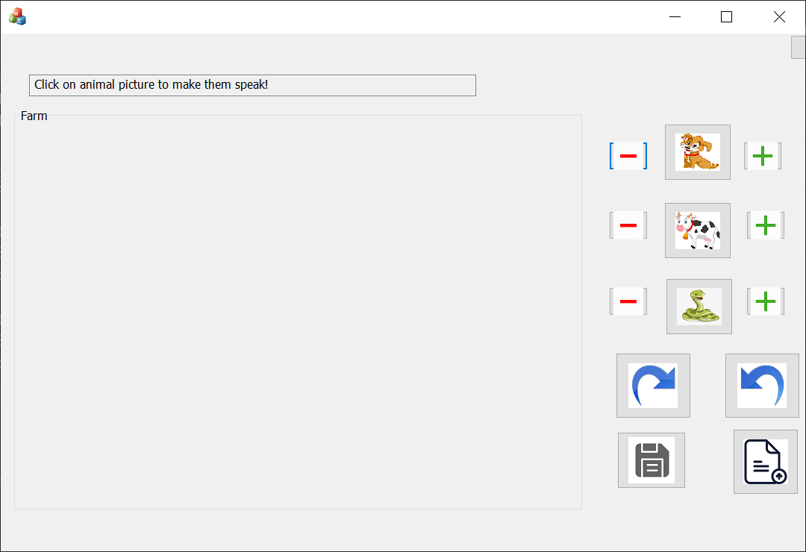
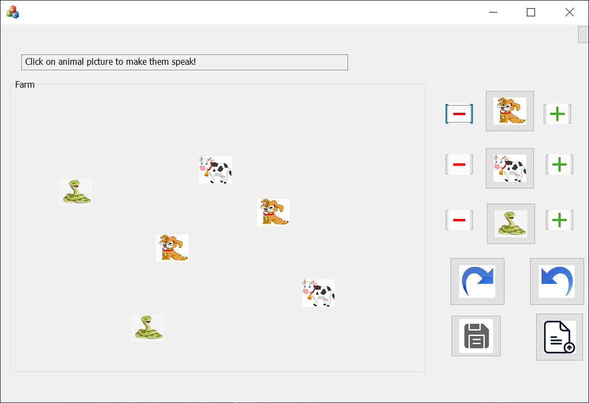

# Farm-Manager
Final project for OOP course in C++, Theme is Farm manager. Draw, add, remove, drag animals and many more actions!

# Description
This is a final project for OOP course.
Project is written in C++ using MFC.

Theme is an animal farm. In the main window you can see all available animals in farm.
For each animal you can:
* Add
    * Click on the plus icon near the image of requested animal.
* Delete
    * Click on the minus icon near the image of requested animal.
* Speak (if possible according to animal biology)
    * Click on the animal image on the menu.
* Draw
    * Once some animal clicked - Matching image will be added to the farm area.
* Drag
    * Right click on animal's image on farm area to move it around!
* Move
    * Left click on animal's image once, A blue indicator will be appeared. 
    Left click again anywhere inside the farm area to move the animal to this position.

# OOP concepts used
* Inheritance
* Polymorphism
* Abstract Classes
* Event-Driven program
* C++ STL's
* Function Overloading
* Serialization 

# Examples

